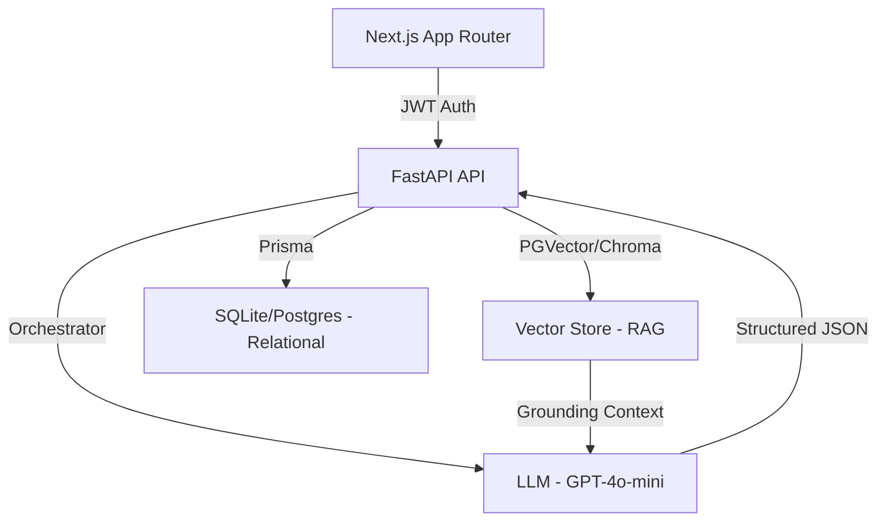

# Codify: Personalized AI-Powered Learning Roadmaps

[](https://nextjs.org/)
[](https://fastapi.tiangolo.com/)
[](https://www.prisma.io/)
[](https://langchain.com/)
[](https://www.trychroma.com/)

Codify is an intelligent learning platform that solves the "paradox of choice" in technical education. It leverages **Retrieval-Augmented Generation (RAG)** to create hyper-personalized learning roadmaps based on a user's specific goals, level, and feedback, grounded in professional industry standards.

---

## 🎯 At a Glance 

From a computer science student's perspective, it is
easy to get lost in a sea of information about breaking into tech. While generic tutorials offer a sea of noise, Codify builds targeted development paths. By mapping expert-curated patterns to your specific schedule, we replace guesswork with a high-fidelity roadmap tailored to your career goals

### Key Features
- **AI Roadmap Orchestration**: Generates 2–4 week intensive plans using context from validated learning resources.
- **Dynamic Task Management**: Progress tracking with automated deadline management and AI-assisted task breakdowns.
- **Enterprise-Grade Auth**: Secure onboarding via LinkedIn OIDC and Google OAuth.
- **Expert-Curated Library**: Hybrid system combining community-vetted "stable" roadmaps with AI flexibility.
- **Iterative Feedback Loop**: Users can signal "too hard" or "don't like this topic" to live-regenerate their path without losing progress.

---

## 🛠 Technical Deep Dive 

### System Architecture
Codify is built as a decoupled **Next.js frontend** and **FastAPI backend**, communicating via a JWT-only security model to minimize database round-trips and maximize scalability.



### The RAG Pipeline
Unlike "vibe-coded" AI wrappers, Codify grounds its generations:
- **Vector Store**: Uses **ChromaDB** for local development speed, indexing curated JSON and Markdown documentation from sources like roadmap.sh.
- **Personalization Engine**: The backend orchestrator fetches the Top-5 most relevant context fragments based on user intake data (*level, role target, timeline*) before calling the LLM.
- **Constraint Handling**: Injects user-dislike signals and real-time community upvotes/difficulty tags into the prompt to prevent hallucination.

### Key Engineering Decisions
- **JWT-Only Auth Flow**: The FastAPI backend contains no `users` table. It trusts signed NextAuth JWTs, significantly reducing backend complexity and making high-concurrency state management more resilient.
- **Shared Schema (frontend/backend)**: Prisma logic is shared between the SQLite dev environment and the eventual Postgres production environment, ensuring schema consistency across the stack.
- **Dual-Stack Testing**: 
    - **Frontend**: Vitest for unit logic + Playwright for E2E browser automation.
    - **Backend**: Pytest with `respx` for deterministic LLM mocking, ensuring CI/CD passes without calling expensive external APIs.

---

## 🚀 Getting Started

### Prerequisites
- Node.js 20+
- Python 3.11+
- OpenAI API Key

### Installation

1. **Clone & Install Frontend**
   ```bash
   cd roadmap-platform/frontend/codify
   npm install
   npx prisma generate
   npm run dev
   ```

2. **Setup Backend**
   ```bash
   cd roadmap-platform/backend
   python -m venv venv
   source venv/bin/activate  # venv\Scripts\activate on Windows
   pip install -r requirements.txt
   python main.py
   ```

3. **Environment Variables**
   Ensure `.env` files are configured in both `frontend/codify` and `backend` (see `.env.example` in each directory).

---

## 🧪 Testing Suite

We maintain high code quality through rigorous automated testing:

```bash
# Run Frontend Tests
npm test                # Vitest
npx playwright test     # E2E

# Run Backend Tests
pytest                  # Backend Unit/Integration
```

---

## 📈 Roadmap & Future
- [ ] Transition from ChromaDB to **pgvector** for production scalability.
- [ ] Implement local-first offline syncing for task tracking.
- [ ] Integrated "AI Mentor" chat bot with per-task memory.

---
*Developed with a focus on engineering rigor, scalability, and deterministic AI output.*
