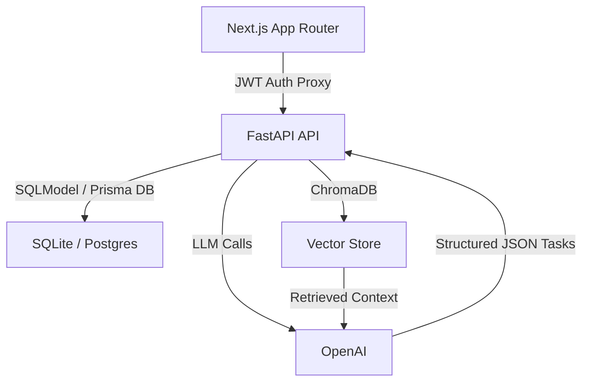

# Codify: Personalized AI-Powered Learning Roadmaps

[](https://nextjs.org/)
[](https://fastapi.tiangolo.com/)
[](https://www.prisma.io/)
[](https://langchain.com/)
[](https://www.trychroma.com/)

Codify is an AI learning platform that generates personalized technical roadmaps from a user's goals, weaknesses, timeline, and target role. It uses a Next.js frontend, a FastAPI backend, and a Retrieval-Augmented Generation (RAG) layer so roadmap generation is grounded in curated knowledge instead of relying only on prompt-only generation.

---

## Overview

Breaking into software engineering is noisy. There are too many tutorials, too many roadmaps, and too much generic advice. Codify reduces that noise by turning onboarding inputs into structured learning plans that are specific to the user.

### Key Features
- **AI roadmap generation**: Creates personalized study plans from onboarding data.
- **RAG grounding**: Retrieves embedded knowledge before generation to improve specificity.
- **Task management**: Supports roadmap editing, task tracking, and deadlines.
- **Curated roadmaps**: Lets users fork prebuilt roadmap templates into their own dashboard.
- **Regeneration loop**: Regenerates plans using user feedback while preserving overall structure.

---

## Architecture

Codify is split into a **Next.js frontend** and **FastAPI backend**, with authenticated requests proxied from the frontend to the backend.



### Core Engineering Decisions
- **JWT-based backend auth**: FastAPI trusts signed tokens from the NextAuth layer instead of maintaining a separate backend auth implementation.
- **Shared development database**: Frontend and backend work against the same local SQLite database in development.
- **Deterministic backend testing**: `pytest` and `respx` are used to mock model calls and verify backend behavior without relying on live LLM responses.

---

## RAG System

### What gets embedded
The RAG layer indexes curated markdown knowledge documents from:

- `roadmap-platform/backend/seed_data/knowledge`

These documents are chunked and embedded into ChromaDB using OpenAI embeddings.

### Embedded status
- **Knowledge base status**: embedded
- **Indexed chunk count**: **48 chunks**
- **Embedding model**: `text-embedding-3-small`
- **Vector store**: ChromaDB

### How ingestion works
The admin `Trigger Re-index` action maps to:

- `POST /admin/rag/ingest`

That route calls `kb.ingest_knowledge_docs()` in `roadmap-platform/backend/knowledge_base.py`, which:

1. Reads markdown files from `seed_data/knowledge`
2. Splits them into chunks with `RecursiveCharacterTextSplitter`
3. Embeds those chunks with OpenAI embeddings
4. Stores them in ChromaDB for retrieval during roadmap generation and regeneration

### Retrieval behavior
When roadmap generation runs with RAG enabled, the backend retrieves relevant knowledge chunks before sending the final prompt to the model. That retrieved context is then used to ground the roadmap in concrete technical material rather than broad generic patterns.

### Validation strategy
RAG quality is validated in two layers:

- **Retrieval validation**: `roadmap-platform/backend/scripts/validate_rag_quality.py` runs representative queries, retrieves top chunks, and evaluates them with an LLM judge on:
  - relevance
  - depth
  - noise
- **Manual product validation**: generated plans are compared with and without retrieval grounding to check whether outputs actually reflect the user’s stated role, weaknesses, and prep goals.

This gives both a technical validation path and a practical product-quality check.

### With RAG vs without RAG
The quality difference was clear during testing.

Without RAG:
- the roadmap generator produced generic advice
- output was broad and not tightly connected to the specific onboarding input
- recommendations felt like generic interview-prep suggestions rather than a targeted plan

With RAG:
- the output became much more specific
- when the input said the user was interested in **frontend** and weak in **data structures and algorithms**, the roadmap focused on:
  - HTML
  - CSS
  - JavaScript
  - data structures
  - algorithms
- instead of random generic advice, the generated roadmap included more detailed guidance on what to prepare, which guides to study, and which kinds of projects to prioritize

In practice, RAG moved the system from “reasonable but generic” to “grounded and clearly aligned with the user’s input.”

---

## Getting Started

### Prerequisites
- Node.js 20+
- Python 3.11+
- OpenAI API key

### Installation

1. **Frontend**
   ```bash
   cd roadmap-platform/frontend/codify
   npm install
   npx prisma generate
   npm run dev
   ```

2. **Backend**
   ```bash
   cd roadmap-platform/backend
   python -m venv venv
   source venv/bin/activate  # On Windows: venv\Scripts\activate
   pip install -r requirements.txt
   python main.py
   ```

3. **Environment variables**
   Configure `.env` files in:
- `roadmap-platform/frontend/codify`
- `roadmap-platform/backend`

---

## Testing

### Frontend
```bash
npm test
npx playwright test
```

### Backend
```bash
pytest
```

### RAG validation
```bash
cd roadmap-platform/backend
venv\Scripts\python.exe scripts\validate_rag_quality.py
```

---

## Future Work
- Transition from ChromaDB to `pgvector` for production retrieval.
- Expand the knowledge corpus beyond the current seeded markdown docs.
- Add richer retrieval debugging and admin evaluation tooling.
- Introduce per-user memory and roadmap evolution over time.

---

Developed with a focus on practical AI grounding, roadmap specificity, and engineering simplicity.
